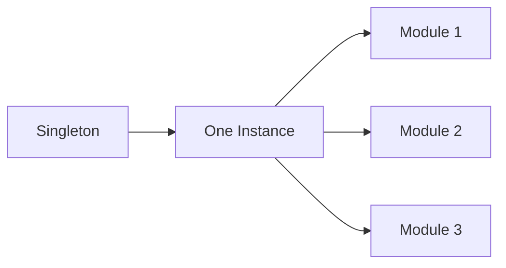

# Question 1: Why can only one object exist in a Singleton?

### Introduction

The Singleton pattern exists to ensure **only one instance** of a class is ever created.
Think of it like a **control tower**: you don’t want multiple towers giving conflicting instructions.

### Key Points

* **Controlled Instance**

  * The class itself manages instance creation.
  * Only one object exists → shared across modules.
  <!-- * (On-screen: “One Object → Many Access Points”) -->

  ```mermaid
  graph LR
  A[Class] --> B[Single Object]
  B --> C[Module 1]
  B --> D[Module 2]
  B --> E[Module 3]
  ```

* **Global Access Point**

  * Singleton provides a single access method, usually `getInstance()`.
  * Everyone accesses the same object → consistent state.
  <!-- * (Narration: “All roads lead to one object.”) -->

* **Resource Optimization**

  * Memory and resources are saved because only one object exists.
  * Ideal for **configurations, logging, or database connections**.
  <!-- * (On-screen: “Save Resources 💾”) -->

* **Consistency Across the App**

  * All modules share the same data/state.
  * No unexpected conflicts from multiple instances.
  <!-- * (Narration: “One truth, everywhere.”) -->

### Final Output / Visual Summary



**Takeaway:** Only one object exists to guarantee **consistency, control, and efficiency**.

---