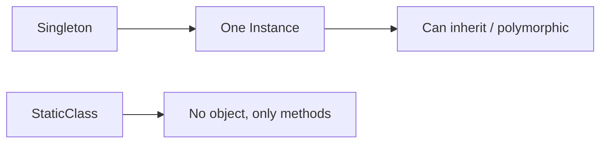

# Question 2: Singleton vs Static class — what’s the real difference?

### Introduction

Many confuse Singletons with static classes, but the difference is huge.
Singletons are **objects**; static classes are **just collections of functions**.

### Key Points

* **Object vs No Object**

  * Singleton → one real instance.
  * Static → no instance, just methods.
  <!-- * (On-screen: “Singleton = Object ✅ | Static = No Object ❌”) -->

* **Inheritance & Polymorphism**

  * Singleton can implement interfaces and extend classes.
  * Static class cannot inherit or be overridden.
  * (Narration: “Static is rigid, Singleton is flexible.”)

* **Memory & Lifecycle**

  * Singleton → created once, destroyed when app ends.
  * Static → methods always available, no object to destroy.
  <!-- * (On-screen: “Lifecycle Matters ⏳”) -->

* **Thread Safety**

  * Singleton → needs locking to avoid race conditions.
  * Static → no instance, so creation race is irrelevant.
  * (Diagram below)

  ```mermaid
  graph TD
  A[Singleton] --> B[One Instance → Needs Sync]
  C[Static Class] --> D[No Instance → Always Available]
  ```

### Final Output / Visual Summary



**Takeaway:** Singletons are objects with flexibility, static classes are rigid and method-only.

---