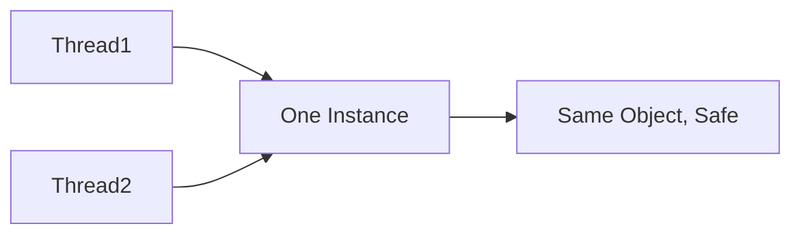

# Question 3: Can multiple threads break the Singleton pattern?

### Introduction

Singletons are easy in a single-threaded app. But **multiple threads** can accidentally create multiple instances.

### Key Points

* **Race Condition Risk**

  * Two threads may call `getInstance()` at the same time.
  * This can create **two instances**, breaking Singleton.
  <!-- * (On-screen: “🚨 Multiple Instances!”) -->

* **Double-Checked Locking**

  * Prevents multiple creations.
  * Check if instance exists → lock → check again → create if needed.
  * (Diagram below)

  ```mermaid
  sequenceDiagram
  participant T1 as Thread 1
  participant T2 as Thread 2
  participant S as Singleton
  T1->>S: Check instance null?
  T2->>S: Check instance null?
  T1->>S: Create instance
  T2->>S: Blocked by lock
  ```

* **Language-Specific Solutions**

  * Java → `synchronized` method or `enum`.
  * C# → `Lazy<T>` initialization.
  <!-- * (On-screen: “Different tools, same goal.”) -->

* **Safe Access Across Threads**

  * Once thread-safety is implemented, Singleton behaves correctly.
  * All threads get **the same object**.

### Final Output / Visual Summary



**Takeaway:** Threads can break Singleton without care. Use **locking or lazy init** to ensure safety.